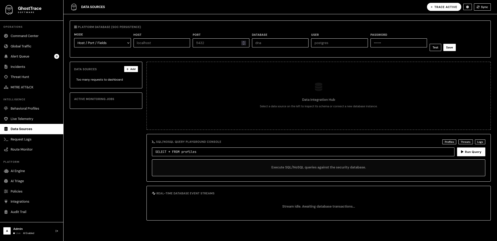
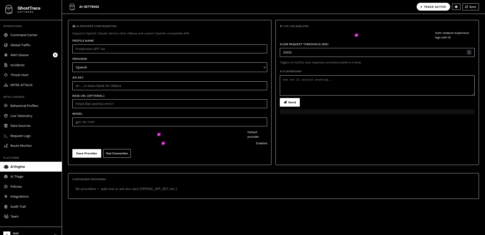
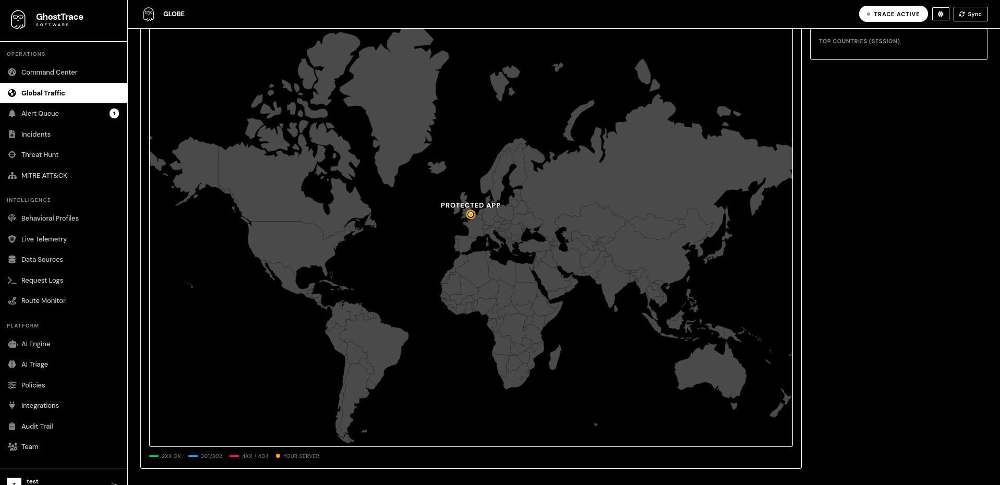

# GhostTrace

Production-grade behavioral defense for Node.js and Express.

GhostTrace adds real-time detection, route protection, and a full SOC dashboard with zero-config defaults. Install, initialize, and protect routes in minutes.

## Installation

```bash
npm install ghosttrace
```

## Quick Start

```javascript
const express = require('express');
const ghosttrace = require('ghosttrace');

const app = express();
app.use(express.json());

(async () => {
  await ghosttrace.init({ app });

  // Protect your API and register routes immediately
  app.use('/api', ghosttrace.secure({ path: '/api', app }));

  app.get('/api/hello', (req, res) => {
    res.json({ message: 'Hello', dna: req.clientDNA });
  });

  app.listen(3000, () => {
    console.log('App: http://localhost:3000');
    console.log('Dashboard: http://localhost:3001');
  });
})();
```

Open the dashboard:
```
http://localhost:3001
```

## Screenshots





## Core Features

- Behavioral fingerprinting (client DNA, device signals, request patterns)
- Threat detection and blocking with configurable thresholds
- SOC dashboard with command center, alerts, incidents, and MITRE mapping
- Threat hunt, route monitor, and audit trail
- SQLite by default, PostgreSQL for shared persistence
- Encrypted secrets storage with auto-generated key file

## Database and Persistence

GhostTrace uses SQLite by default and auto-creates the schema. Use PostgreSQL when:

- You run multiple app instances
- You need shared alert/audit history
- You want long-term persistence across servers

SQLite is production-safe for a single instance. PostgreSQL is recommended for multi-node deployments.

## Encryption and Secrets

If no key is provided, GhostTrace generates and stores one at:

```
./data/ghosttrace.key
```

You can also supply your own:

```env
DATA_ENCRYPTION_KEY=your-strong-key
GHOST_REQUIRE_ENCRYPTION=false
GHOST_ENCRYPTION_KEY_PATH=
```

## Route Registration (Immediate)

To show routes in the Route Monitor without waiting for a request, pass the Express app:

```javascript
app.use('/api', ghosttrace.secure({ path: '/api', app }));
```

## Dashboard Security

By default the dashboard is private (localhost only). To expose it safely:

```env
GHOST_DASHBOARD_PUBLIC=true
GHOST_DASHBOARD_IPS=192.168.1.100,10.0.0.50
GHOST_DASHBOARD_RATE_LIMIT=100
```

## Configuration

```env
# Admin (optional)
GHOST_ADMIN_EMAIL=admin@company.com
GHOST_ADMIN_PASS=secure-password

# Ports
GHOST_PORT=3001

# Security
GHOST_BLOCK_THRESHOLD=70
GHOST_RATE_LIMIT=120
GHOST_BLOCK_ON_THREAT=true

# Database
GHOST_DB_TYPE=postgres
GHOST_DB_HOST=localhost
GHOST_DB_PORT=5432
GHOST_DB_NAME=ghosttrace
GHOST_DB_USER=postgres
GHOST_DB_PASS=password
GHOST_DB_SYNC=true

# AI
GHOST_AI_PROVIDER=openai
GHOST_AI_KEY=sk-...
```

## Production Checklist

- Set dashboard IP whitelist or keep private
- Use a strong admin password
- Enable encryption key (automatic or explicit)
- Use PostgreSQL for multi-instance deployments
- Back up ./data/ghosttrace.sqlite if staying on SQLite
- Tune thresholds and rate limits to your traffic

## Troubleshooting

- If you see "No routes registered", ensure you passed `{ app }` to `secure()`.
- If SOC or Hunt shows "Database error", verify DB credentials or use SQLite.
- If client details are missing, ensure the dashboard is running on port 3001.

## License

MIT License. See `LICENSE`.
